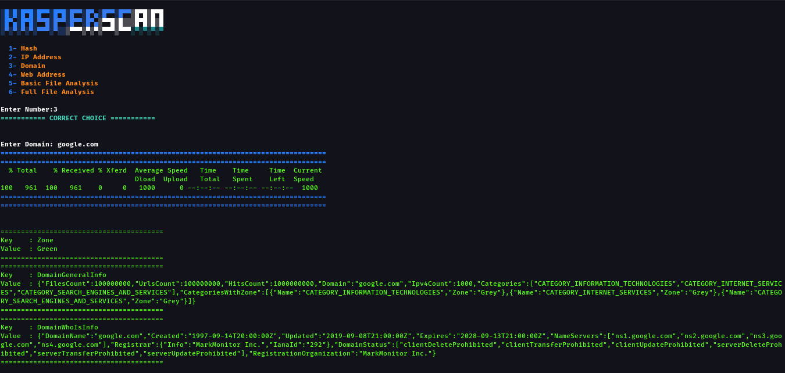

# KasperScan

  

# What is KasperScan?

KasperScan is an open-source tool written in Bash, utilizing the Kaspersky API to scan :
- Hashes
- URLs
- IP Addresses
- Files
- And more...

  

# Clone KasperScan Tool

`git clone https://github.com/aker-1/KasperScan.git`   

# Usage
`cd KasperScan`  
`chmod 777 *`  
`./Scan_KasperSky.sh`  
 
# Screenshot

  

 

# Requirements

Linux or macOS

Bash Shell

Kaspersky API Key (Get it from here)

 

# Contributing

Feel free to improve the tool by submitting Pull Requests.

Report issues by opening GitHub Issues.

 

# License

This tool is licensed under the MIT License.

## Contact with me

