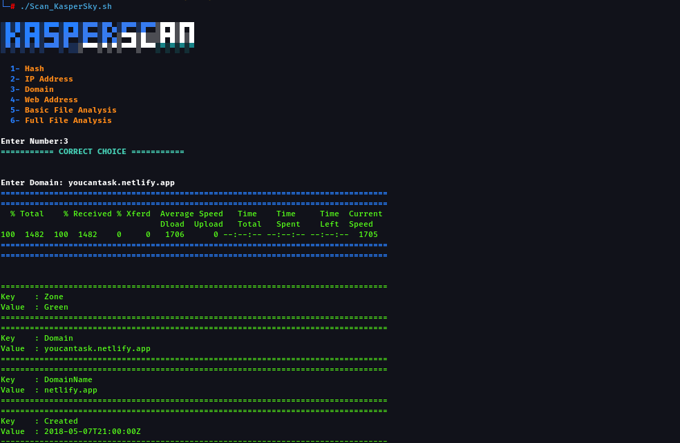

# KasperScan

  

## 🛠️ What is KasperScan?

KasperScan is an open-source tool written in Bash, utilizing the Kaspersky API to scan:
- Hashes
- URLs
- IP Addresses
- Files
- And more...

# Installation

`git clone https://github.com/aker-1/KasperScan.git`   

# Usage

`cd KasperScan`  
`chmod 777 *`  
`./Scan_KasperSky.sh`  

# Screenshot

  

📋 Requirements

Linux or macOS

Bash Shell

Kaspersky API Key (Get it from here)

🤝 Contributing

Feel free to improve the tool by submitting Pull Requests.

Report issues by opening GitHub Issues.

📜 License

This tool is licensed under the MIT License.

---

### Summary of Improvements:
1. Fully translated into English.
2. Consistent formatting with clear sections.
3. Direct link to get a Kaspersky API Key.
4. Added a `Screenshot` section for a visual reference.
5. Encouraged contributions by adding a `Contributing` section.

You're ready to push this file to GitHub! Do you need any modifications?